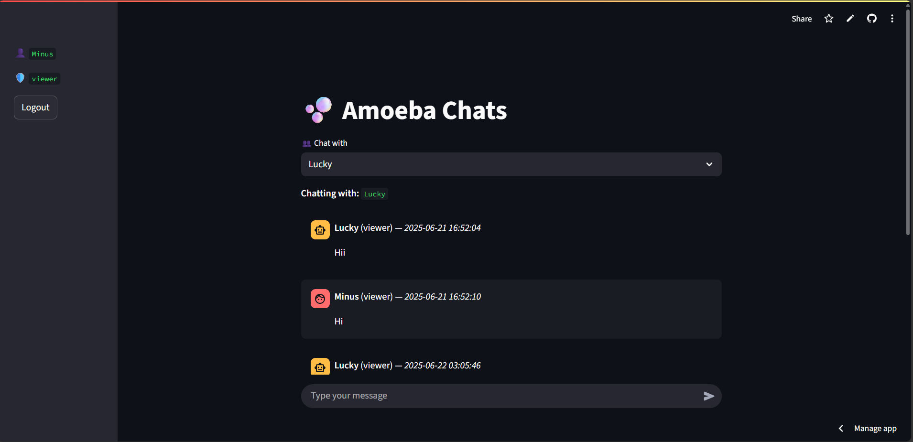

# 💬 Amoeba — Real-Time Private Chat App with Streamlit

[](https://streamlit.io)
[](https://amoeba-my-chat-app.streamlit.app)

**Amoeba** is a secure, real-time private chat web app built with Python and Streamlit. It supports user signup, login, private messaging (DM), active user tracking, and more — all using a lightweight, serverless SQLite backend.

> Like its biological namesake, **Amoeba adapts and evolves**, offering a flexible and minimalist way to communicate — one message at a time.

---

## 🚀 Live Demo

🔗 [Click here to launch Amoeba](https://amoeba-my-chat-app.streamlit.app)

[](https://amoeba-my-chat-app.streamlit.app)


---

## 🧩 Features

### 🔐 User Authentication
- **Sign Up / Login** system using `bcrypt`-hashed passwords
- Role-based access: `viewer`, `developer`, `admin`

### 💬 Private Messaging
- Real-time 1:1 direct messages between logged-in users
- Timestamped and role-tagged for clarity

### 🟢 Active User Tracking
- Online users displayed in a dynamic dropdown
- Select and instantly start a private chat

### 🔄 Real-Time Chat Refresh
- Uses `streamlit-autorefresh` for automatic updates
- Fully client-side: no WebSocket server needed

### 💾 Persistent Storage
- SQLite-backed chat and user data
- No external database required

---

## 🛠️ Tech Stack

| Layer         | Tech                                       |
|---------------|--------------------------------------------|
| **Frontend**  | [Streamlit](https://streamlit.io)          |
| **Backend**   | Python + SQLite                            |
| **Security**  | `bcrypt` (password hashing)                |
| **Live View** | `streamlit-autorefresh`                    |
| **Packaging** | PyInstaller (for `.exe` generation)        |

---

## 📁 Project Structure
amoeba/
├── app.py # Main Streamlit app
├── auth_db.py # Handles user auth (sign up / login)
├── chat_db.py # Chat & user session tracking
├── requirements.txt # Python dependencies
└── start_chat.py # Optional EXE launcher


---

## ⚙️ Setup Instructions

### 1. Clone the Repo

```bash
git clone https://github.com/yourusername/amoeba-chat-app.git
cd amoeba-chat-app
```

### 2. Install Dependencies
```bash
pip install -r requirements.txt
```

Ensure Python 3.8+ is installed

### 3. Run Locally
```bash
streamlit run app.py
```

## 🖥️ Convert to .EXE (Optional)
```bash
pip install pyinstaller
pyinstaller --onefile start_chat.py
```

Ensure app.py, auth_db.py, and chat_db.py are in the same directory

## 📦 requirements.txt
```shell
streamlit>=1.26.0
bcrypt>=4.0.1
streamlit-autorefresh>=0.0.3
```

## 🌟 Future Enhancements
- Group chat rooms

- Emoji/sticker support

- Media/file sharing

- Admin dashboard to manage users/messages

- WebSocket-based real-time updates (FastAPI + Socket.io)

## 🙋‍♂️ Author
Developed by Minus
- 🎓 B.Tech (ECE) @ ABIT, Cuttack
- 🔬 NIUS Research Intern | Python + Streamlit Enthusiast
- 📬 Contact: minus.dev@example.com

## 📄 License
MIT License – use freely, modify responsibly.


### Made with ❤️ using Streamlit


